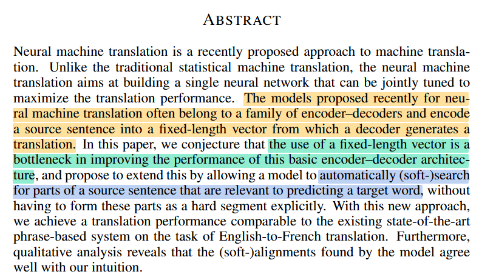
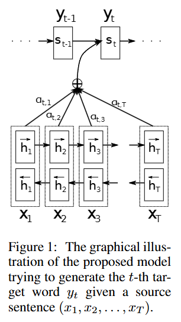
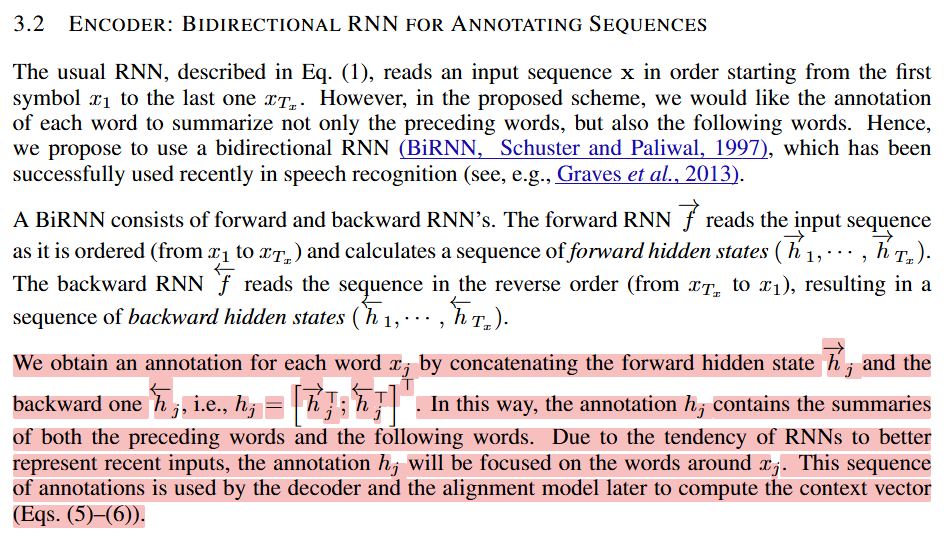
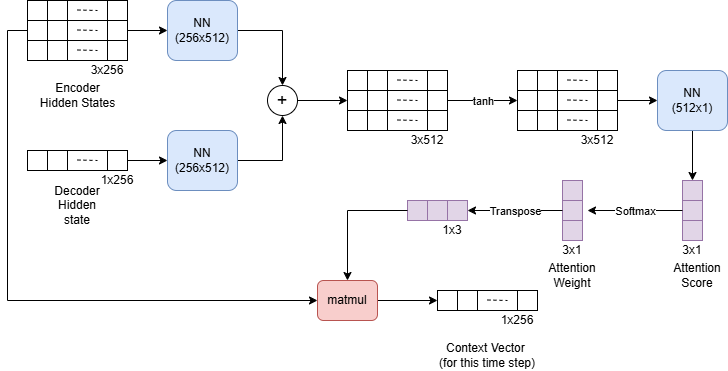
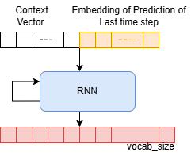

# 8. Bahdanau Attention (Additive Attention)

In the approach by [Cho et al., 2014](https://emnlp2014.org/papers/pdf/EMNLP2014179.pdf) and [Sutskever et al., 2014](https://proceedings.neurips.cc/paper_files/paper/2014/file/5a18e133cbf9f257297f410bb7eca942-Paper.pdf), the authors employed an RNN encoder-decoder framework for neural machine translation, specifically by encoding a variable-length source sentence into a fixed-length vector. The latter would then be decoded into a variable-length target sentence.

However, [Bahdanau et al. (2014)](https://arxiv.org/pdf/1409.0473) argued that representing an entire sentence with one fixed-size vector loses information as sentences become longer. They introduced an attention mechanism that lets the decoder look at different parts of the input sentence while generating each output word, improving translation quality.

The statement is highlighted in the paper screenshot below: 


To better understand the motivation behind the proposed attention mechanism, we first examine the abstract of the seminal work by [Bahdanau et al. (2014)](https://arxiv.org/pdf/1409.0473), which outlines the limitations of the conventional encoder–decoder architecture and the rationale for introducing attention.



The following points are particularly significant in the Abstract:

1. Recent encoder–decoder models represent the entire source sentence using a single fixed-length vector.
2. This fixed-length vector becomes a `bottleneck`, especially for long sentences, because it cannot capture all the information in the source sentence.
3. To solve this problem, an `additive attention` mechanism was introduced that allows the decoder to automatically focus on the most relevant parts of the source sentence when predicting each target word.

## Proposed model

First, let's try to understand the proposed model mathematicallty. Later in the article we try to simplyfy the explanation using visuals, if you have already understood the mathematics, please feel free to skip the part. 

Here, the figure for the proposed model from the paper: 



### Encoder



The role of the encoder is to generate an annotation, $h_𝑖$ (concatenation of forward hidden states, and backward hidden states), for every word, $x_i$, in an input sentence of length $T$ words.

$$\mathbf{h}_i = \left[ \overrightarrow{\mathbf{h}_i^T} \; ; \; \overleftarrow{\mathbf{h}_i^T} \right]^T$$


### Decoder

The decoder is responsible for generating the target sequence by selectively attending to the most relevant information encoded in the source sentence. To achieve this, it employs an attention mechanism, which enables the model to dynamically assign varying levels of importance to different parts of the input sequence during each step of the decoding process. This mechanism enhances the model's ability to capture contextual dependencies and improves the accuracy of the generated output.

Here is how the calculations in decoder occurs: 

Firstly, the goal of the decoder is to decode/predict the next word. 

To predict the next word, the following values are required: 
1. hidden states of the encoder $(h)$
2. Previous predicted word/ouput index ($y$) ($<BOS>$ index for the first time instance.)
2. hidden state of the decoder RNN of the last time step $(S_{t-1})$ 

At the **first time instance (t=1)**:

$$
s_1 = RNN(y_0, h_{T_x})
$$

where:
- $y_0$ is the index of the `<BOS>` (Beginning of Sequence) token, and
- $h_{T_x}$ is the hidden state of the last word in the source sequence.

The context vector for the first decoding step is computed using the attention mechanism:

$$
c_1 = Attention(s_1, h)
$$

or equivalently,

$$
c_1 = \sum_{j=1}^{T_x} \alpha_{1j} h_j
$$

where the attention weights are calculated as:

$$
\alpha_{1j} = \frac{\exp(e_{1j})}{\sum_{k=1}^{T_x}\exp(e_{1k})}
$$

The attention weights at the first decoding time step can be written as:

$$
\alpha_{1,i} = \text{softmax}(e_{1,i})
$$

where the attention score is defined as:

$$
e_{1,j}=a(s_1,h_j)
$$

or,

$$
e_{1,j} = v^T \tanh(W_1 h_j + W_2 s_1)
$$

The attention weights $\alpha_{1,i}$ determine the importance of each encoder hidden state $h_i$ when generating the first target word. 

Using the `decoder state` $s_1$ and the `context vector` $c_1$, 
- the decoder generates the `first target word` $y_1$.


At the **second time instance (t=2)**:

The decoder takes the previously generated word $y_1$ and the previous hidden state $s_1$ to compute the next hidden state:

$$
s_2 = RNN(y_1, s_1)
$$

where:
- $y_1$ is the target word generated at the first decoding step, and
- $s_1$ is the previous decoder hidden state.

Using the updated decoder state, the attention mechanism recalculates the attention weights over all encoder hidden states:

$$
c_2 = Attention(s_2,h)
$$

or,

$$
c_2 = \sum_{j=1}^{T_x} \alpha_{2j} h_j
$$

where the attention weights are:

$$
\alpha_{2j} = \frac{\exp(e_{2j})}{\sum_{k=1}^{T_x}\exp(e_{2k})}
$$

and the attention score is:

$$
e_{2j}=a(s_2,h_j)
$$

The decoder then generates the second target word $y_2$ using the updated hidden state $s_2$ and the context vector $c_2$.

This process continues for subsequent decoding steps, where each decoder state attends to the most relevant parts of the source sequence to generate the next target word.

----


Now, the context vector and the encoder hidden step for this time step is concatenated, and passed through a feed-forward network.



- The softmax function produces a probability distribution over the target vocabulary. 
- The word corresponding to the highest probability is selected as the predicted word for the current decoding time step.

### Code

**BahdanauAttention**

```python
class BahdanauAttention(nn.Module):
    def __init__(self, hidden_size):
        super(BahdanauAttention, self).__init__()
        self.Wa = nn.Linear(hidden_size, hidden_size)
        self.Ua = nn.Linear(hidden_size, hidden_size)
        self.Va = nn.Linear(hidden_size, 1)

    def forward(self, query, keys):
        scores = self.Va(torch.tanh(self.Wa(query) + self.Ua(keys)))
        scores = scores.squeeze(2).unsqueeze(1)

        weights = F.softmax(scores, dim=-1)
        context = torch.bmm(weights, keys)

        return context, weights
```

**Decoder**: 

```python
class AttnDecoderRNN(nn.Module):
    def __init__(self, hidden_size, output_size, dropout_p=0.1):
        super(AttnDecoderRNN, self).__init__()
        self.embedding = nn.Embedding(output_size, hidden_size)
        self.attention = BahdanauAttention(hidden_size)
        self.rnn = nn.RNN(2 * hidden_size, hidden_size, batch_first=True)
        self.out = nn.Linear(hidden_size, output_size)
        self.dropout = nn.Dropout(dropout_p)

    def forward(self, encoder_outputs, encoder_hidden, target_tensor=None):
        batch_size = encoder_outputs.size(0)
        decoder_input = torch.empty(batch_size, 1, dtype=torch.long, device=device).fill_(SOS_token)
        decoder_hidden = encoder_hidden
        decoder_outputs = []
        attentions = []

        for i in range(MAX_LENGTH):
            decoder_output, decoder_hidden, attn_weights = self.forward_step(
                decoder_input, decoder_hidden, encoder_outputs
            )
            decoder_outputs.append(decoder_output)
            attentions.append(attn_weights)

            if target_tensor is not None:
                # Teacher forcing: Feed the target as the next input
                decoder_input = target_tensor[:, i].unsqueeze(1) # Teacher forcing
            else:
                # Without teacher forcing: use its own predictions as the next input
                _, topi = decoder_output.topk(1)
                decoder_input = topi.squeeze(-1).detach()  # detach from history as input

        decoder_outputs = torch.cat(decoder_outputs, dim=1)
        decoder_outputs = F.log_softmax(decoder_outputs, dim=-1)
        attentions = torch.cat(attentions, dim=1)

        return decoder_outputs, decoder_hidden, attentions


    def forward_step(self, input, hidden, encoder_outputs):
        embedded =  self.dropout(self.embedding(input))

        query = hidden.permute(1, 0, 2) # seq_len, batch, hidden_size -> batch, seq_len, hidden_size
        context, attn_weights = self.attention(query, encoder_outputs)
        input_rnn = torch.cat((embedded, context), dim=2)

        output, hidden = self.rnn(input_rnn, hidden)
        output = self.out(output)

        return output, hidden, attn_weights
```
___

**Instruction**:

Replace the decoder implementation in the Lab 7 code with the attention-based decoder described above. The encoder implementation remains unchanged.

## Summary

- The goal of Bahdanau attention (from the paper ["Neural Machine Translation by Jointly Learning to Align and Translate"](https://arxiv.org/pdf/1409.0473) by Dzmitry Bahdanau, Kyunghyun Cho, and Yoshua Bengio) was to solve the main weakness of early encoder-decoder translation models: the fixed-length bottleneck. Before attention, the encoder compressed an entire source sentence into one final hidden vector, forcing the decoder to extract all information from that single representation; this became especially problematic for long sentences because important details were lost. 
- Bahdanau attention introduced a mechanism where the decoder could dynamically look back at all encoder hidden states and learn which source words are relevant at each generation step, effectively creating a soft alignment between input and output words (e.g., when generating "house" in English, the model can attend strongly to "maison" in French). This was `Additive Attention`. 
- The improvement was that translation quality increased significantly, especially for longer sentences, because the model no longer needed to memorize the entire sentence in one vector—it could retrieve information when needed. 
- In the current context, the core idea of Bahdanau attention remains extremely important because it introduced the concept of selective information retrieval, which became the foundation for modern Transformer architectures: Transformers replaced recurrent attention with self-attention, allowing every token to directly interact with every other token in parallel, but the fundamental idea remains the same
    - do not compress everything into one hidden state; instead, learn what information is important for each prediction step.

---
### References:

- [Neural Machine Translation by Jointly Learning to Align and Translate](https://arxiv.org/pdf/1409.0473)
- [Machine Learning Mastery](https://machinelearningmastery.com/the-bahdanau-attention-mechanism/)
- [Dive into Deep Learning](https://d2l.ai/chapter_attention-mechanisms-and-transformers/bahdanau-attention.html)
- [Pytorch Documentation](https://docs.pytorch.org/tutorials/intermediate/seq2seq_translation_tutorial.html)