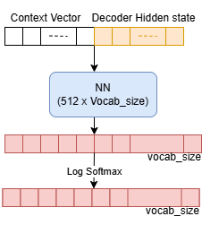

# 8. Luong Attention (Multiplicative Attention)

In the approach by [Bahdanau et al. (2014)](https://arxiv.org/pdf/1409.0473), the authors introduced an additional feed-forward network to compute alignment scores between decoder and encoder states which we now refer to as `Additive Attention`. This gave the encoder-decoder architecture the ability to dynamically focus on different parts of the input sequence while generating each output token, instead of relying on a single fixed-length context vector produced by the encoder. It also allowed the model to learn soft alignments between source and target words, improving translation quality, especially for longer sequences where information was often lost in traditional sequence-to-sequence models.

To summarize, the two main contributions introduced by **Bahdanau et al. (2014)** that remain highly influential today are:

- **Replacing the single fixed-length context vector with access to all encoder hidden states.**
    - Instead of forcing the encoder to compress the entire input sequence into one vector, the decoder can access the complete set of encoder representations and retrieve relevant information when generating each output token.
- **Introducing additive attention as a mechanism for learning soft alignments.**
    - The model learns which parts of the input sequence are most relevant for each decoding step by computing attention scores between decoder and encoder states, allowing it to focus on the specific words or regions needed for generating the next token.

Together, these ideas transformed the encoder-decoder architecture from a fixed information bottleneck into a dynamic retrieval system, forming the foundation for later attention mechanisms and ultimately influencing the development of Transformer architectures.

## Luong et al. (2015), "Effective Approaches to Attention-based Neural Machine Translation"


Luong et. al., explored `more direct scoring functions` (such as `dot product`, general, and concatenation-based attention) and introduced two important design choices: 
    - `Global attention`, where the decoder considers all encoder hidden states, and 
    - `Local attention`, where it focuses only on a predicted window of source positions to reduce computation.  

### Encoder

The encoder generates an annotation ($h_i$) for each source word ($x_i$) in an input sentence of length ($T$). Each annotation is formed by concatenating the forward and backward hidden states of a bidirectional RNN:

$$
h_i = [\overrightarrow{h_i}; \overleftarrow{h_i}]
$$

where (\overrightarrow{h_i}) represents the forward hidden state and (\overleftarrow{h_i}) represents the backward hidden state.

## Decoder

The decoder functions slightly differently. 

### 1. Decoder RNN
The current decoder hidden state is computed as: 
$$ s_t = RNN_{decoder}(s_{t-1}, y_{t-1}) $$

Here, 
- $s_{t-1}$ denotes the previous hidden decoder state and 
- $y_{t-1}$ the previous decoder output. 
---

### 2. Alignment Model

The alignment model $a(\cdot)$ determines how well the current decoder state matches each encoder annotation. It computes an **alignment score** $e_{t,i}$ between the decoder hidden state at time step $t$ and the encoder hidden state corresponding to the source word $x_i$:

$$
e_{t,i} = a(s_t, h_i)
$$

where:

- $e_{t,i}$ is the **alignment score** indicating how relevant the $i$-th source word is when generating the $t$-th target word.
- $s_t$ is the current decoder hidden state, representing the decoder's current context while generating a target word.
- $h_i$ is the encoder annotation for the $i$-th source word, containing information from the encoder.
- $a(\cdot)$ is a learnable scoring function (alignment model) that measures the compatibility between $s_t$ and $h_i$.

There paper two different attention to compute the `alignment score`. 
1. Global Attention
2. Local Attention

#### **2.1. Global Attention**

The **global attention model** considers all source words in the input sentence when computing the alignment scores and, consequently, when generating the context vector.

For a target word at time step $t$, the decoder compares its current hidden state $s_t$ with every encoder hidden state $h_i$ to determine how much attention should be assigned to each source word.

Luong et al. propose three different scoring functions for computing the alignment score:

$$
e_{t,i} = a(s_t, h_i)
$$

The three approaches are:

**2.1.1. Concatenation-based Attention (similar to Bahdanau's additive attention)**

$$
a(s_t, h_i) = v_a^T \tanh(W_a[s_t;h_i])
$$

This approach concatenates the decoder hidden state $s_t$ and encoder hidden state $h_i$, then applies a feed-forward neural network to compute the alignment score.

**2.1.2 Dot-Product Attention** (most influential)

$$
a(s_t, h_i) = s_t^T h_i
$$

This approach directly computes the similarity between the decoder state and encoder state using their dot product.

**2.1.3. General Attention**

$$
a(s_t, h_i) = s_t^T W_a h_i
$$

The general approach introduces a trainable weight matrix $W_a$ before computing the dot product, allowing the model to learn a transformation between the decoder and encoder representations.

Here:

- $W_a$ is a trainable weight matrix.
- $v_a$ is a trainable weight vector.
- $[s_t;h_i]$ represents the concatenation of the decoder state and encoder annotation.

**Global Attention Intuition**

The multiplicative attention approaches (dot-product and general attention) measure the similarity between the decoder state $s_t$ and encoder state $h_i$.

The dot-product formulation:

$$
s_t^T h_i
$$

can be interpreted as asking:

> "How similar are the decoder's current representation and the representation of this source word?"

A larger dot-product value indicates that the source word represented by $h_i$ is more relevant for generating the current target word.

Compared with Bahdanau's additive attention, Luong's multiplicative attention is computationally simpler because it replaces a feed-forward network with matrix operations.

#### **2.2. Local Attention**

The **global attention model** considers all source words when computing the alignment scores and context vector. However, this can become computationally expensive for long input sequences because the decoder must compare its hidden state with every encoder annotation at each decoding step.

To address this limitation, Luong et al. introduce the **local attention model**, which computes the context vector using only a subset of encoder annotations within a fixed-size window around a predicted alignment position $p_t$.

The attention window is defined as:

$$
[p_t-D,\ p_t+D]
$$

where:

- $p_t$ is the predicted aligned source position for target time step $t$.
- $D$ is a manually selected window size.
- Only encoder annotations $h_i$ inside this window contribute to the context vector.

The local attention context vector is computed as a weighted average over the selected annotations:

$$
c_t = \sum_{i=p_t-D}^{p_t+D}\alpha_{t,i}h_i
$$

where $\alpha_{t,i}$ represents the attention weight for the source position $i$.

Luong et al. propose two methods for determining the alignment position $p_t$:

---

### 1. Monotonic Alignment

This approach assumes that source and target words are approximately aligned in the same order.

Therefore:

$$
p_t = t
$$

This works well for language pairs where word order is relatively similar.

---

### 2. Predictive Alignment

Instead of assuming a fixed alignment, the model learns to predict the source position that should be attended to.

The predicted position is computed as:

$$
p_t = S \cdot \text{sigmoid}(v_p^T \tanh(W_p s_t))
$$

where:

- $S$ is the length of the source sentence.
- $s_t$ is the current decoder hidden state.
- $W_p$ and $v_p$ are trainable parameters used to predict the aligned position.

The sigmoid function ensures that the predicted position is within the valid source sentence range:

$$
0 \leq p_t \leq S
$$

---

### 3. Attention Weights
The alignment scores are converted into attention weights using a softmax function:

$$
\alpha_{t,i} =
\frac{\exp(e_{t,i})}
{\sum_{j=1}^{T}\exp(e_{t,j})}
$$

where $\alpha_{t,i}$ represents how much attention the decoder should assign to the $i$-th source word when generating the $t$-th target word.

---

### 4. Context Vector

The context vector is then computed as a weighted sum of all encoder annotations:

$$
c_t = \sum_{i=1}^{T}\alpha_{t,i}h_i
$$

---

### 5. Attentional Hidden State 

After computing the context vector $c_t$ using the attention weights, the model combines the context vector with the current decoder hidden state $s_t$ to create an **attentional hidden state** $\tilde{s}_t$.

The attentional hidden state is computed as:

$$
\tilde{s}_t = \tanh(W_c[c_t; s_t])
$$

where:

- $\tilde{s}_t$ is the attentional hidden state used for generating the output.
- $c_t$ is the context vector obtained from the weighted sum of encoder annotations.
- $s_t$ is the current decoder hidden state.
- $[c_t; s_t]$ denotes the concatenation of the context vector and decoder hidden state.
- $W_c$ is a learnable weight matrix that transforms the concatenated representation.

The attentional hidden state combines information from both:
- the **source sentence** through the context vector $c_t$, and
- the **previously generated target sequence** through the decoder state $s_t$.

---

### 6. Output Generation

The decoder produces a final output by feeding it a weighted attentional hidden state:

$$
y_t = \text{softmax}(W_y\tilde{s}_t)
$$

where:

- $y_t$ is the predicted probability distribution for the target word at time step $t$.
- $W_y$ is the output projection matrix.
- $\tilde{s}_t$ is the attentional hidden state.

The decoding process is repeated autoregressively:

1. Update the decoder hidden state.
2. Compute alignment scores between the decoder state and encoder annotations.
3. Convert alignment scores into attention weights.
4. Compute the context vector.
5. Generate the attentional hidden state.
6. Predict the next target word.

These steps are repeated until the end-of-sequence token is generated.

---


Source: [Advanced Deep Learning with Python](https://www.amazon.com/Advanced-Deep-Learning-Python-next-generation/dp/178995617X)



```Python
import torch
import torch.nn as nn
import torch.nn.functional as F


class LuongDotAttention(nn.Module):
    def __init__(self, hidden_size):
        super(LuongDotAttention, self).__init__()

        # For:
        # s~_t = tanh(W_c[c_t;s_t])
        self.Wc = nn.Linear(hidden_size * 2, hidden_size)


    def forward(self, query, keys):
        """
        query:
            Current decoder hidden state s_t
            Shape: (batch_size, 1, hidden_size)

        keys:
            Encoder hidden states h_1,...,h_T
            Shape: (batch_size, seq_len, hidden_size)

        Returns:
            attentional_hidden:
                s~_t
                Shape: (batch_size, 1, hidden_size)

            weights:
                attention weights alpha_t
                Shape: (batch_size, 1, seq_len)
        """

        # Alignment scores:
        # e_{t,i} = s_t^T h_i
        scores = torch.bmm(
            query,
            keys.transpose(1, 2)
        )

        # Attention weights:
        # alpha_{t,i} = softmax(e_{t,i})
        weights = F.softmax(scores, dim=-1)

        # Context vector:
        # c_t = sum(alpha_{t,i} * h_i)
        context = torch.bmm(
            weights,
            keys
        )

        # Concatenate context and decoder hidden state:
        # [c_t ; s_t]
        combined = torch.cat(
            (context, query),
            dim=-1
        )

        # Attentional hidden state:
        # s~_t = tanh(W_c[c_t;s_t])
        attentional_hidden = torch.tanh(
            self.Wc(combined)
        )

        return attentional_hidden, weights
```

`Question`: Do you think we need to change the decoder code too? 

## Summary

- The goal of Luong attention (from the paper ["Effective Approaches to Attention-based Neural Machine Translation"](https://arxiv.org/pdf/1508.04025) by Thang Luong, Hieu Pham, and Christopher Manning) was to make attention mechanisms simpler, faster, and more effective for neural machine translation after Bahdanau attention showed that dynamic alignment was valuable. 
- Bahdanau attention introduced an additional feed-forward network to compute alignment scores between decoder and encoder states, 
- Luong et. al., explored `more direct scoring functions` (such as `dot product`, general, and concatenation-based attention) and introduced two important design choices: 
    - `Global attention`, where the decoder considers all encoder hidden states, and 
    - `Local attention`, where it focuses only on a predicted window of source positions to reduce computation. 
- The main improvement was that Luong attention provided a more efficient attention mechanism with competitive or better translation performance, especially when combined with stronger recurrent architectures like multi-layer LSTMs. 
- Luong showed that attention could be computed through direct vector similarity, making it simpler and computationally efficient. (`multiplicative global attention using dot product`)
- This idea became highly influential because it established the foundation for modern attention mechanisms: representing attention as `query-key` matching followed by a weighted sum of values. 
- The Transformer architecture later generalized this idea into scaled dot-product attention, where queries, keys, and values are learned projections of the input representations. 
- Therefore, while dynamic context retrieval (`local attention`) was the conceptual breakthrough of attention in general, Luong's multiplicative/dot-product attention (*global attention*) is the specific mechanism that most directly influenced the attention operation used in today's large language models.

### References:

- [Effective Approaches to Attention-based Neural Machine Translation](https://arxiv.org/pdf/1508.04025)
- [Machine Learning Mastery](https://machinelearningmastery.com/the-luong-attention-mechanism/)
- [Jay Allamar's Blog](https://jalammar.github.io/visualizing-neural-machine-translation-mechanics-of-seq2seq-models-with-attention/)