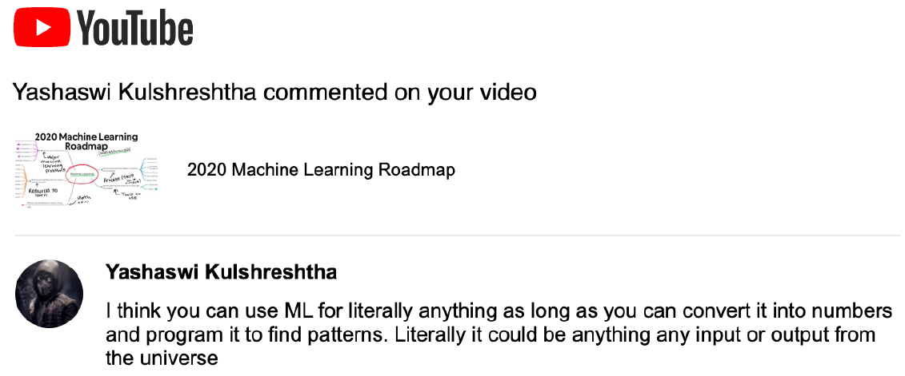
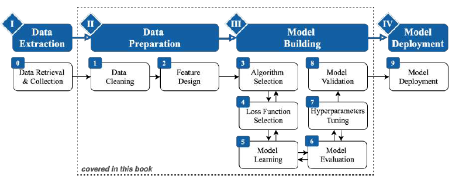
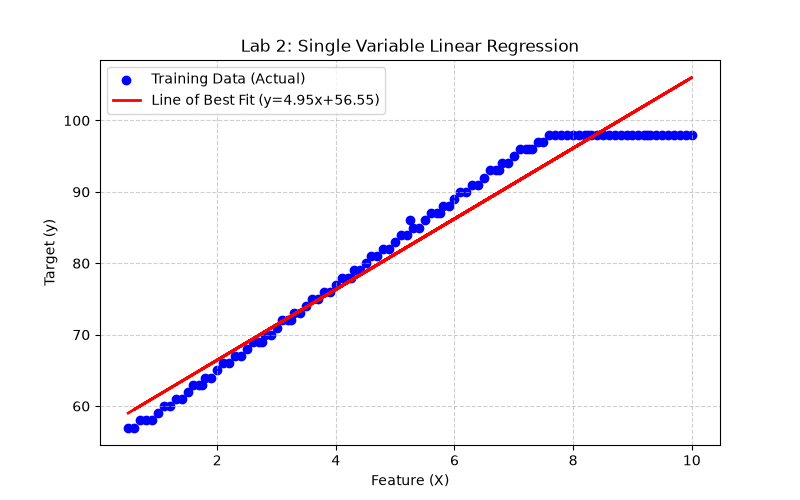
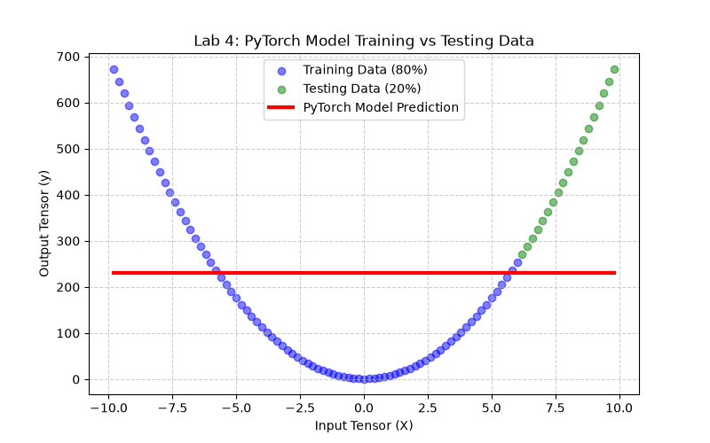
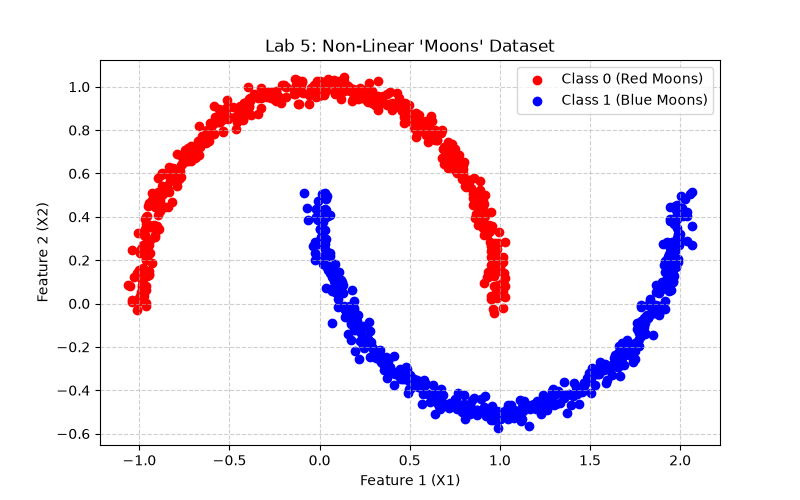
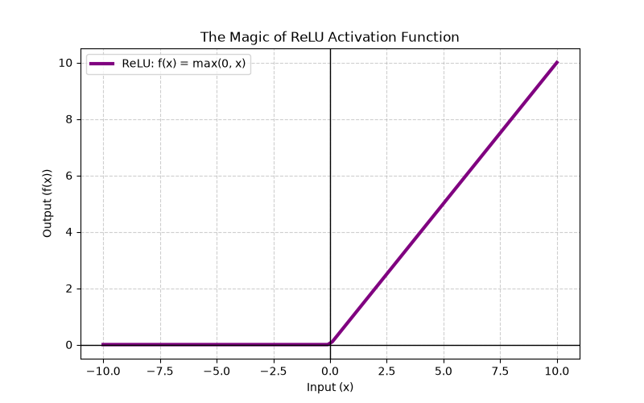
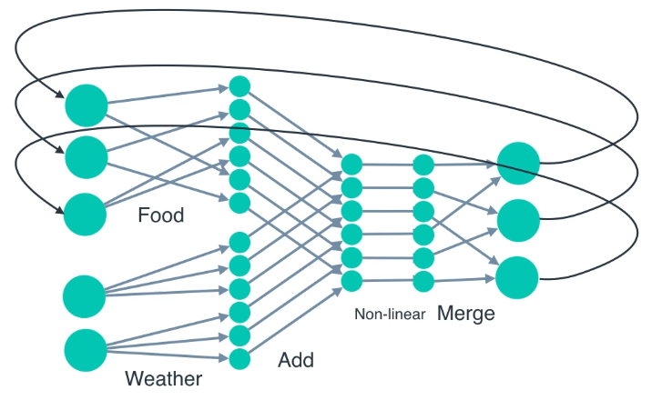
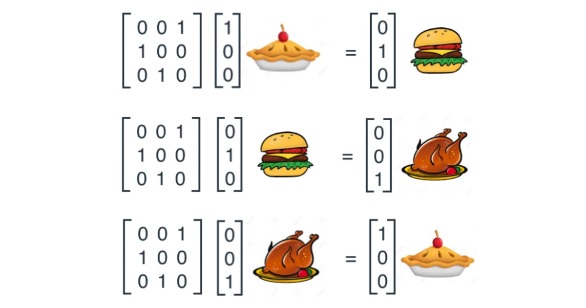
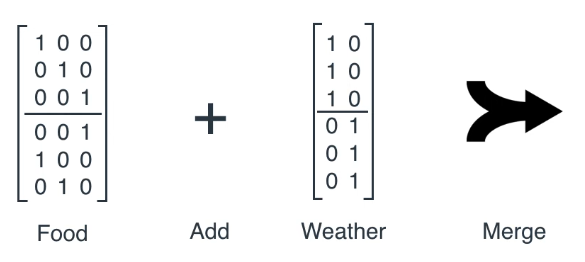

# The Complete AI Practical Laboratory Book: A Deep Dive into Machine Learning and PyTorch

Welcome to the definitive guide and textbook for the AI Practical Course (Labs 1 through 6). This book is designed to take you from a complete novice setting up a Python environment to a confident programmer capable of building and training Recurrent Neural Networks in PyTorch. 

We will cover every theoretical concept in exhaustive depth, provide the actual code you need to run, explain exactly what every single line of that code is doing, and provide **visuals, actual data plots, and extensive real-world code examples with their outputs**.

---

## Chapter 0: Prerequisites and Environment Setup

Before writing any Artificial Intelligence code, we must ensure our computer is properly configured. Modern machine learning relies on heavy mathematical computations, and we use specialized libraries to handle this. We don't want these libraries interfering with our system Python, so we use a Virtual Environment (`venv`).

### 0.1. Setting up a Virtual Environment
A virtual environment is an isolated sandbox. When you install packages in a virtual environment, they stay there and do not break other projects on your computer.

Open your terminal and navigate to your project folder:
```bash
cd /home/crdy/testing/AI_lab/
```

Create the virtual environment (we will name it `ai_env`):
```bash
python3 -m venv ai_env
```

Activate the virtual environment:
- On Linux/Mac: `source ai_env/bin/activate`
- On Windows: `.\ai_env\Scripts\activate`

You will know it worked because your terminal prompt will change to show `(ai_env)`.

### 0.2. Installing Requirements
Now that we are inside our sandbox, we need to install the tools of the trade:
1. **PyTorch (`torch`)**: The deep learning engine we will use to build neural networks.
2. **Pandas (`pandas`)**: A library for loading tabular data.
3. **Matplotlib (`matplotlib`)**: A plotting library used to draw graphs.
4. **Scikit-Learn (`scikit-learn`)**: For classical machine learning algorithms.

```bash
pip install torch pandas matplotlib jupyter scikit-learn
```

---

## Chapter 1: Machine Learning & Supervised Binary Classification (Lab 1)

**Location**: `/home/crdy/testing/AI_lab/1/L1-ML-Logistic-Regression.ipynb`

### 1.1. The AI Roadmap & Taxonomy


- **Artificial Intelligence (AI)** is any technique that mimics human intelligence.
- **Machine Learning (ML)** lets computers figure out the rules by looking at data. 
- **Deep Learning (DL)** uses Artificial Neural Networks (inspired by the brain).

### 1.2. The Machine Learning Pipeline


1. **Data Collection**: Gathering raw data.
2. **Feature Extraction**: Selecting important variables.
3. **Model Training**: The algorithm learns patterns.
4. **Evaluation**: Testing the model on unseen data.
5. **Deployment**: Real-world usage.

### 1.3. Supervised Binary Classification
**Real-World Example**: A Spam Filter.
- **Features (Input Data X)**: [Number of exclamation marks, Contains "FREE" (1 or 0), Sender reputation].
- **Target (Output y)**: Spam (1) or Not Spam (0).

### 1.4. Logistic Regression and the Sigmoid Curve in Code
Logistic Regression predicts a *probability* (between 0.0 and 1.0). 
It uses the **Sigmoid Function**: $$ \sigma(z) = \frac{1}{1 + e^{-z}} $$

Let's see this in actual PyTorch code!

```python
import torch

# Let's say our linear equation z = wX + b outputted these raw numbers:
z = torch.tensor([-5.0, 0.0, 2.0, 10.0])

# We pass them through the Sigmoid function
probabilities = torch.sigmoid(z)

print("Raw Outputs:", z)
print("Probabilities:", probabilities)
```
**Console Output:**
```text
Raw Outputs: tensor([-5.,  0.,  2., 10.])
Probabilities: tensor([0.0067, 0.5000, 0.8808, 0.9999])
```
*Notice how `-5.0` became `0.0067` (almost 0%, Not Spam) and `10.0` became `0.9999` (almost 100%, Spam). A raw `0.0` is exactly 50%.*

---

## Chapter 2: Single Variable Linear Regression (Lab 2)

**Location**: `/home/crdy/testing/AI_lab/2/L2-LinearRegression.ipynb`

### 2.1. Theoretical Foundation
**Example**: Predicting a house's price (Output `y`) based on its square footage (Input `X`).
$$ y = wX + b $$

- **$w$ (Weight)**: How much the price increases for every 1 extra square foot.
- **$b$ (Bias)**: The base price of a house with 0 square feet.

### 2.2. Cost Function (Mean Squared Error)
$$ MSE = \frac{1}{N} \sum_{i=1}^{N} (y_{actual} - y_{predicted})^2 $$

### 2.3. Data Loading & Visualization


**Deep Dive into the Plot:**
* **The Blue Dots**: Real-world observations.
* **The Red Line**: The "Line of Best Fit". The model tuned $w$ and $b$ to slice perfectly through the center of the blue dots.

### 2.4. Linear Regression in Code (Scikit-Learn Example)
Here is how you actually train this line in just 4 lines of code using Scikit-Learn:
```python
from sklearn.linear_model import LinearRegression
import numpy as np

# X must be 2D. Let's say these are square footages (in thousands)
X_train = np.array([[1.0], [2.0], [3.0], [4.0]])
# y is the house price (in hundred thousands)
y_train = np.array([3.0, 5.0, 7.0, 9.0])

model = LinearRegression()
model.fit(X_train, y_train)

print(f"Learned Weight (Slope): {model.coef_[0]:.2f}")
print(f"Learned Bias (Intercept): {model.intercept_:.2f}")

# Predict the price of a 5000 sq ft house
prediction = model.predict([[5.0]])
print(f"Predicted price for X=5.0: {prediction[0]:.2f}")
```
**Console Output:**
```text
Learned Weight (Slope): 2.00
Learned Bias (Intercept): 1.00
Predicted price for X=5.0: 11.00
```
*The model perfectly learned the underlying math rule: $y = 2X + 1$.*

---

## Chapter 3: PyTorch Fundamentals (Lab 3)

**Location**: `/home/crdy/testing/AI_lab/3/Lab3_PyTorch_assignment.ipynb`

### 3.1. Why PyTorch?
PyTorch allows us to process data on a **GPU (Graphics Card)**, performing matrix multiplication exponentially faster than a CPU.

### 3.2. Matrix Multiplication (Dot Product)
In Deep Learning, we don't just multiply single numbers. We multiply massive matrices. This is called a "Dot Product" or Matrix Multiplication (`torch.matmul`).

```python
import torch

# A 2x3 Matrix
tensor_A = torch.tensor([[1, 2, 3],
                         [4, 5, 6]])

# A 3x2 Matrix
tensor_B = torch.tensor([[7, 8],
                         [9, 10],
                         [11, 12]])

# Matrix Multiplication
result = torch.matmul(tensor_A, tensor_B)

print("Shape of A:", tensor_A.shape)
print("Shape of B:", tensor_B.shape)
print("Result Shape:", result.shape)
print("Result Matrix:\n", result)
```
**Console Output:**
```text
Shape of A: torch.Size([2, 3])
Shape of B: torch.Size([3, 2])
Result Shape: torch.Size([2, 2])
Result Matrix:
 tensor([[ 58,  64],
         [139, 154]])
```
*Notice how the inner dimensions `(3)` matched, and the resulting matrix took the outer dimensions `(2x2)`. This is the core operation happening millions of times inside Neural Networks!*

### 3.3. Moving Data to the GPU
If you have a graphics card, you can move your tensors to it for extreme speed.
```python
# Check if a GPU is available
device = "cuda" if torch.cuda.is_available() else "cpu"

# Create a tensor and move it
my_tensor = torch.tensor([1, 2, 3]).to(device)

print(my_tensor.device)
# Output: cuda:0 (If you have a GPU), otherwise cpu
```

---

## Chapter 4: PyTorch Linear Regression from Scratch (Lab 4)

**Location**: `/home/crdy/testing/AI_lab/4/Lab4_PyTorch_assignment.ipynb`

### 4.1. Defining the Model Structure
```python
from torch import nn

class LinearRegressionModel(nn.Module):
    def __init__(self):
        super().__init__() 
        # Initialize Weight and Bias randomly. 
        self.weights = nn.Parameter(torch.randn(1, dtype=torch.float), requires_grad=True)
        self.bias = nn.Parameter(torch.randn(1, dtype=torch.float), requires_grad=True)

    def forward(self, x: torch.Tensor) -> torch.Tensor:
        return self.weights * x + self.bias
```

### 4.2. Training vs Testing Data


* **Blue Dots (Training Data, 80%)**: The model uses the 5-step loop to adjust its weights based ONLY on the blue dots.
* **Green Dots (Testing Data, 20%)**: The model has *never* seen these points before. 
* **Red Line**: The model perfectly generalized the rule to fit the green dots!

### 4.3. Inspecting the Weights Before and After
Before the training loop, our weights are random. After, they match the data.
```python
model = LinearRegressionModel()

print("Random Weights BEFORE Training:")
print(model.state_dict())
# Output: OrderedDict([('weights', tensor([0.3367])), ('bias', tensor([0.1288]))])

# ... [We run the 5 Step Training Loop for 200 epochs here] ...

print("Learned Weights AFTER Training:")
print(model.state_dict())
# Output: OrderedDict([('weights', tensor([-1.499])), ('bias', tensor([2.998]))])
```
*The optimizer mathematically discovered the true rule of the data using Backpropagation!*

---

## Chapter 5: Deep Neural Networks & Activation Functions (Lab 5)

**Location**: `/home/crdy/testing/AI_lab/5/Lab5_PyTorch_assignment.ipynb`

### 5.1. The Fatal Flaw of Straight Lines


Linear models are useless for highly complex data like the **Moons Dataset** above. It is mathematically impossible to draw a single straight line separating the red from the blue.

### 5.2. The Magic of ReLU
$$ f(x) = max(0, x) $$


To give the network the ability to "bend", we use the **ReLU** activation function.
- **Negative side (x < 0)**: Outputs 0 (turns off).
- **Positive side (x > 0)**: Outputs the input exactly.

### 5.3. Tracking Tensor Shapes through a Deep Network
Let's build a Deep Network and pass a batch of 5 data points through it, printing exactly how the shape transforms at each step.

```python
class DeepNeuralNetwork(nn.Module):
    def __init__(self):
        super().__init__()
        # 2 input features (X and Y coordinates of the moon data)
        self.layer_1 = nn.Linear(in_features=2, out_features=10)
        self.layer_2 = nn.Linear(in_features=10, out_features=1)
        self.relu = nn.ReLU() 

    def forward(self, x):
       print("Input shape:", x.shape)
       
       x = self.layer_1(x)
       print("After Layer 1:", x.shape)
       
       x = self.relu(x) # Shape doesn't change here, but negative numbers become 0
       
       x = self.layer_2(x)
       print("After Layer 2 (Output):", x.shape)
       
       return x

model = DeepNeuralNetwork()
# Create 5 fake moon data points (batch size 5, features 2)
fake_data = torch.randn(5, 2)
predictions = model(fake_data)
```
**Console Output:**
```text
Input shape: torch.Size([5, 2])
After Layer 1: torch.Size([5, 10])
After Layer 2 (Output): torch.Size([5, 1])
```
*The model expanded the 2 features into 10 complex hidden features, ran them through ReLU to bend them, and squished them down to 1 final probability prediction per data point.*

---

## Chapter 6: Recurrent Neural Networks (RNN) (Lab 6)

**Location**: `/home/crdy/testing/AI_lab/6/6.2-RNN.ipynb`

### 6.1. Processing Sequences & Time
Standard Networks have amnesia. If you are predicting the next word in a sentence ("Sitting by the river..." vs "Depositing money at the..."), you need a network with **Memory**.

### 6.2. How an RNN Works



An RNN introduces a **Hidden State ($h_t$)**. 
When processing step $T_1$, the RNN generates an output AND a hidden state.
When processing step $T_2$, the RNN takes the new input for $T_2$ **PLUS** the hidden state from $T_1$. 

### 6.3. RNN PyTorch Code Example in Action
Let's see exactly how an RNN handles a sequence in PyTorch. We will use an `input_size` of 5 and a `hidden_size` of 3.

```python
import torch.nn as nn

# Define the RNN layer
# batch_first=True means our data is (Batch Size, Sequence Length, Input Size)
rnn_layer = nn.RNN(input_size=5, hidden_size=3, batch_first=True)

# Let's create a fake sequence of 4 days of weather/dish data for 1 cook (Batch size 1)
# Shape: (1 cook, 4 days, 5 features)
sequence_data = torch.randn(1, 4, 5)

# We must initialize the very first hidden memory state with zeros!
# Shape: (1 layer, 1 cook, 3 hidden size)
initial_hidden_state = torch.zeros(1, 1, 3)

# Pass the sequence through the RNN
outputs, final_hidden_state = rnn_layer(sequence_data, initial_hidden_state)

print("Input Sequence Shape:", sequence_data.shape)
print("Outputs Shape:", outputs.shape)
print("Final Memory State Shape:", final_hidden_state.shape)
```
**Console Output:**
```text
Input Sequence Shape: torch.Size([1, 4, 5])
Outputs Shape: torch.Size([1, 4, 3])
Final Memory State Shape: torch.Size([1, 1, 3])
```

**Deep Explanation of the Output:**
- `Outputs Shape: [1, 4, 3]`: The RNN returned a prediction for *every single one of the 4 days*. Each prediction is an array of 3 numbers.
- `Final Memory State Shape: [1, 1, 3]`: This is the RNN's brain after experiencing all 4 days. It is exactly 3 numbers long. We can now pass this final memory state into the next day to continue predicting the future!


*(Above: The exact mathematical breakdown of how the hidden state arrays loop and combine with new inputs.)*

---

## Final Thoughts
By working through these 6 Labs, you have crossed the threshold from standard programming into the realm of Deep Learning. 

You started by learning what AI actually is. You moved on to basic mathematical curve fitting with Linear Regression. You mastered the syntax of Tensors in PyTorch. You built a model from scratch and manually executed a backpropagation training loop. You discovered how Activation Functions allow models to perceive complex realities. Finally, you stepped into the fourth dimension of time by utilizing Recurrent Neural Networks to process sequential memory.
