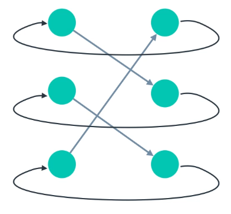
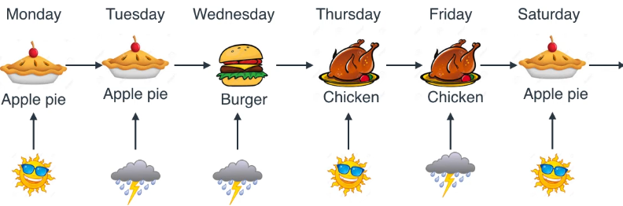

# The Complete AI Practical Laboratory Book: A Deep Dive into Machine Learning and PyTorch

Welcome to the definitive guide and textbook for the AI Practical Course (Labs 1 through 6). This book is designed to take you from a complete novice setting up a Python environment to a confident programmer capable of building and training Recurrent Neural Networks in PyTorch. 

We will cover every theoretical concept in exhaustive depth, provide the actual code you need to run, explain exactly what every single line of that code is doing, and provide **visuals, graphs, and real-world examples** to cement your understanding.

---

## Chapter 0: Prerequisites and Environment Setup

Before writing any Artificial Intelligence code, we must ensure our computer is properly configured. Modern machine learning relies on heavy mathematical computations, and we use specialized libraries to handle this. We don't want these libraries interfering with our system Python, so we use a Virtual Environment (`venv`).

### 0.1. Setting up a Virtual Environment
A virtual environment is an isolated sandbox. When you install packages in a virtual environment, they stay there and do not break other projects on your computer.

Open your terminal and navigate to your project folder:
```bash
cd /home/crdy/testing/AI_lab/
```

Create the virtual environment (we will name it `ai_env`):
```bash
python3 -m venv ai_env
```

Activate the virtual environment:
- On Linux/Mac: `source ai_env/bin/activate`
- On Windows: `.\ai_env\Scripts\activate`

You will know it worked because your terminal prompt will change to show `(ai_env)`.

### 0.2. Installing Requirements
Now that we are inside our sandbox, we need to install the tools of the trade. For this course, you need the following primary libraries:
1. **PyTorch (`torch`)**: The deep learning engine we will use to build neural networks.
2. **Pandas (`pandas`)**: A library for loading, manipulating, and analyzing tabular data (like CSV files).
3. **Matplotlib (`matplotlib`)**: A plotting library used to draw graphs and visualize our data.
4. **Jupyter (`jupyter`)**: To run interactive `.ipynb` notebook files.
5. **Scikit-Learn (`scikit-learn`)**: For classical machine learning algorithms.

Install them using pip:
```bash
pip install torch pandas matplotlib jupyter scikit-learn
```

---

## Chapter 1: Machine Learning & Supervised Binary Classification (Lab 1)

**Location**: `/home/crdy/testing/AI_lab/1/L1-ML-Logistic-Regression.ipynb`

### 1.1. The AI Roadmap & Taxonomy


Before writing algorithms, it is crucial to understand the hierarchy of the field, as shown in the roadmap above:
- **Artificial Intelligence (AI)** is the broadest concept. It refers to any technique that enables computers to mimic human intelligence.
- **Machine Learning (ML)** is a subset of AI. Instead of explicitly programming the rules, we give the computer data and the answers, and let the computer figure out the rules. 
- **Deep Learning (DL)** is a subset of ML based on Artificial Neural Networks, which are inspired by the human brain.

### 1.2. The Machine Learning Pipeline


The graph above visualizes how data flows through a typical Machine Learning pipeline:
1. **Data Collection & Preprocessing**: Gathering data and cleaning it (removing missing values, scaling numbers).
2. **Feature Extraction**: Selecting the most important variables that influence the outcome.
3. **Model Training**: Passing the features through an algorithm to learn patterns.
4. **Evaluation**: Testing the model on unseen data.
5. **Deployment**: Using the model in the real world to make predictions.

### 1.3. Supervised Binary Classification
In Supervised Learning, our data comes with "labels" (we know the correct answers). 
"Binary Classification" specifically means there are only two possible labels.

**Real-World Example**: A Spam Filter.
- **Features (Input Data)**: Number of exclamation marks, presence of the word "FREE", sender reputation score.
- **Target (Output)**: Spam (Class 1) or Not Spam (Class 0).

### 1.4. Logistic Regression and the Sigmoid Curve
To solve binary classification, we use **Logistic Regression**. 
Instead of predicting a continuous number, Logistic Regression predicts a *probability* (a value between 0.0 and 1.0). 

It does this by taking a linear equation ($z = wX + b$) and passing it through a **Sigmoid Function**:
$$ \sigma(z) = \frac{1}{1 + e^{-z}} $$

If the probability output is $> 0.5$, the model predicts Class 1. If $< 0.5$, it predicts Class 0.

---

## Chapter 2: Single Variable Linear Regression (Lab 2)

**Location**: `/home/crdy/testing/AI_lab/2/L2-LinearRegression.ipynb`

### 2.1. Theoretical Foundation
While classification separates data into categories, **Regression** predicts a continuous numerical value. 
**Example**: Predicting a house's price (Output `y`) based on its square footage (Input `X`).

Single Variable Linear Regression uses one input feature to predict one output target.
The mathematical model is:
$$ y = wX + b $$

- **$y$**: The predicted output (House Price).
- **$X$**: The input data (Square footage).
- **$w$ (Weight)**: The slope of the line. It tells us how much the price increases for every 1 extra square foot.
- **$b$ (Bias)**: The y-intercept. The base price of a house with 0 square feet.

### 2.2. Cost Function (Mean Squared Error)
When we start, our model has random values for $w$ and $b$. To know exactly how "wrong" our line is, we use the **Mean Squared Error (MSE)**.

$$ MSE = \frac{1}{N} \sum_{i=1}^{N} (y_{actual} - y_{predicted})^2 $$

### 2.3. Data Loading & Visualization with Pandas and Matplotlib
Before training, we must visualize our data. Here is how we do it:
```python
import pandas as pd
import matplotlib.pyplot as plt

# Load data from CSV
df = pd.read_csv('data.csv')

# Plot the data
plt.scatter(df['X'], df['y'], color='blue', label='Actual Data')
plt.plot(df['X'], df['predicted_y'], color='red', label='Line of Best Fit')
plt.legend()
plt.title("Linear Regression Visualization")
plt.show()
```
*Visualizing the data ensures we don't try to fit a straight line to completely curved data.*

---

## Chapter 3: PyTorch Fundamentals (Lab 3)

**Location**: `/home/crdy/testing/AI_lab/3/Lab3_PyTorch_assignment.ipynb`

### 3.1. Why PyTorch?
PyTorch allows us to process data on a **GPU (Graphics Card)**, which has thousands of cores and can perform matrix multiplication exponentially faster than a standard CPU. It also provides **Automatic Differentiation (Autograd)** to handle the complex calculus needed for Deep Learning.

### 3.2. Tensors: The Heart of PyTorch
A tensor is a multi-dimensional array of numbers. Let's look at the code and exact outputs:

```python
import torch

# 1. Creating a scalar (0D)
scalar = torch.tensor(7)
print(scalar.ndim)  
# Output: 0

# 2. Creating a vector (1D)
vector = torch.tensor([1, 2, 3, 4])
print(vector.shape) 
# Output: torch.Size([4])

# 3. Creating a matrix (2D)
matrix = torch.tensor([[1, 2], [3, 4]])
print(matrix.shape) 
# Output: torch.Size([2, 2])
```

### 3.3. Advanced Tensor Operations (Reshaping & Slicing)
As models get complex, we frequently need to alter tensor shapes to make matrices match up for multiplication.
```python
x = torch.arange(1., 10.) # tensor([1., 2., 3., 4., 5., 6., 7., 8., 9.])

# Reshape a 1D vector into a 3x3 2D matrix
x_reshaped = x.view(3, 3)
print(x_reshaped)
# Output: 
# tensor([[1., 2., 3.],
#         [4., 5., 6.],
#         [7., 8., 9.]])

# Slicing: Get the first row, all columns
print(x_reshaped[0, :]) 
# Output: tensor([1., 2., 3.])
```

**The Golden Rule of Debugging PyTorch:**
1. `tensor.shape`: Do the matrices align for multiplication? 
2. `tensor.dtype`: Neural network weights must be floats, not integers.
3. `tensor.device`: Is one tensor on the `cpu` and another on `cuda:0`? They must be on the same device!

---

## Chapter 4: PyTorch Linear Regression from Scratch (Lab 4)

**Location**: `/home/crdy/testing/AI_lab/4/Lab4_PyTorch_assignment.ipynb`

### 4.1. Defining the Model Structure
```python
from torch import nn

class LinearRegressionModel(nn.Module):
    def __init__(self):
        super().__init__() 
        # Initialize Weight and Bias randomly. requires_grad=True enables calculus derivatives!
        self.weights = nn.Parameter(torch.randn(1, dtype=torch.float), requires_grad=True)
        self.bias = nn.Parameter(torch.randn(1, dtype=torch.float), requires_grad=True)

    def forward(self, x: torch.Tensor) -> torch.Tensor:
        # The core logic: y = wX + b
        return self.weights * x + self.bias
```

### 4.2. The 5-Step PyTorch Training Loop
```python
# Mean Absolute Error (L1Loss is less sensitive to extreme outliers than MSE)
loss_fn = nn.L1Loss()
# Stochastic Gradient Descent (SGD) with a Learning Rate of 0.01
optimizer = torch.optim.SGD(params=model.parameters(), lr=0.01)

epochs = 200
for epoch in range(epochs):
    model.train() # Put model in training mode
    
    # 1. Forward Pass: Make predictions
    y_pred = model(X_train)
    
    # 2. Calculate the Loss: How wrong were the predictions?
    loss = loss_fn(y_pred, y_train)
    
    # 3. Zero Gradients: Clear the calculus derivatives from the last loop
    optimizer.zero_grad()
    
    # 4. Backward Pass: Calculate derivatives for W and B
    loss.backward()
    
    # 5. Optimizer Step: Move W and B downhill to minimize error
    optimizer.step()
```

---

## Chapter 5: Deep Neural Networks & Activation Functions (Lab 5)

**Location**: `/home/crdy/testing/AI_lab/5/Lab5_PyTorch_assignment.ipynb`

### 5.1. The Fatal Flaw of Straight Lines
Linear models are useless for highly complex data. In Lab 5, we encountered the **Moons Dataset**—a 2D dataset shaped like two interlocking crescent moons. You cannot draw a straight line to separate them. 

### 5.2. The Illusion of Stacked Linear Layers
If you stack two linear layers on top of each other, mathematically, they collapse into a single linear layer.
$y = 2x$, $z = 3y \Rightarrow z = 3(2x) = 6x$. It is still just a straight line! 

### 5.3. The Magic of ReLU
To give the network the ability to "bend" its decision boundary, we inject a **Non-Linear Activation Function**.
The most common is **ReLU (Rectified Linear Unit)**:
$$ f(x) = max(0, x) $$

```python
class DeepNeuralNetwork(nn.Module):
    def __init__(self):
        super().__init__()
        self.layer_1 = nn.Linear(in_features=2, out_features=10)
        self.layer_2 = nn.Linear(in_features=10, out_features=10)
        self.layer_3 = nn.Linear(in_features=10, out_features=1)
        self.relu = nn.ReLU() # The magic non-linear function

    def forward(self, x):
       # The network can now learn complex, curved boundaries!
       return self.layer_3(self.relu(self.layer_2(self.relu(self.layer_1(x)))))
```

---

## Chapter 6: Recurrent Neural Networks (RNN) (Lab 6)

**Location**: `/home/crdy/testing/AI_lab/6/6.2-RNN.ipynb`

### 6.1. Processing Sequences & Time
Standard Feedforward Networks have amnesia. But what if you are predicting the next word in a sentence? 
The word "Bank" means something different if the previous words were "Sitting by the river..." compared to "Depositing money at the...". We need a network with **Memory**.

### 6.2. How an RNN Works


*(Above: A high-level view showing how an RNN loops back on itself.)*


*(Above: The internal vector/matrix multiplication happening inside the RNN cell.)*

An RNN introduces a **Hidden State ($h_t$)**. 
When processing step $T_1$, the RNN generates an output AND a hidden state.
When processing step $T_2$, the RNN takes the new input for $T_2$ **PLUS** the hidden state from $T_1$. 

### 6.3. The Critical Parameter: `hidden_size`
In our lab, we predicted a cook's next dish based on the current dish and the weather.


*(Above: A detailed breakdown of the exact mathematical operations occurring at each time step combining inputs and hidden states.)*


*(Above: Visualizing how a single input is processed through the hidden layers to produce an output.)*


*(Above: A concrete example showing an RNN processing multiple inputs over time.)*

- **Input Size**: 5 (3 dish types + 2 weather types).
- **Hidden Size**: 3.

**What does `hidden_size=3` mean?**
It means the network compresses all of its historical memory into an array of exactly 3 floating-point numbers. 
- If `hidden_size` is too small, the network suffers amnesia.
- If `hidden_size` is too large, the network requires massive amounts of RAM and risks memorizing the exact training data instead of learning the underlying logic (Overfitting).
- A size of 3 was optimal to map back to the 3 possible dish predictions in our final output layer.

---

## Final Thoughts
By working through these 6 Labs, you have crossed the threshold from standard programming into the realm of Deep Learning. 

You started by learning what AI actually is. You moved on to basic mathematical curve fitting with Linear Regression. You mastered the syntax of Tensors in PyTorch. You built a model from scratch and manually executed a backpropagation training loop. You discovered how Activation Functions allow models to perceive complex realities. Finally, you stepped into the fourth dimension of time by utilizing Recurrent Neural Networks to process sequential memory.
